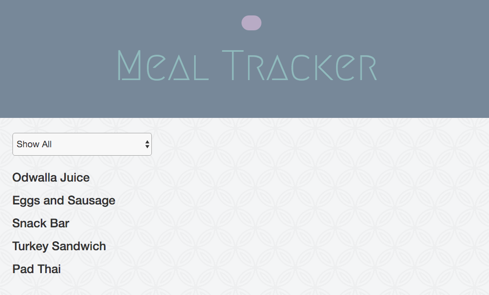

# Meal Tracker Assessment

## Epicodus JavaScript, Week 2: Practice building a web app with Angular2

### By: Jordan Meier

### Description

This week's code review is a website where a user can log each meal they eat and track their caloric intake.



### Known Bugs

* The format in which the date is displaying is not ideal.
* Due to the fact that some meals are hardcoded, the dates listed will only reflect the date/time at which the page was loaded for those meals.

### Setup

Clone this repo on to your desktop, make sure that you have node.js installed on your computer and then:
* navigate into the project folder.
* In your terminal, run the commands:
```shell
npm install
bower install
```
* Once they are finished installing successfully, enter the commands:
```shell
gulp build
gulp serve
```
* You should now be able to view the website!

### Technologies Used
* HTML
* CSS
* SCSS
* TypeScript
* JavaScript
* Node.js
* Angular2
* bower
* npm
* Gulp
* Bootstrap v3.3.6

###Copyright & Licensing

Copyright (c) 2015 **Jordan Meier**

*This software is licensed under the MIT license.*

Permission is hereby granted, free of charge, to any person obtaining a copy
of this software and associated documentation files (the "Software"), to deal
in the Software without restriction, including without limitation the rights
to use, copy, modify, merge, publish, distribute, sublicense, and/or sell
copies of the Software, and to permit persons to whom the Software is
furnished to do so, subject to the following conditions:

The above copyright notice and this permission notice shall be included in
all copies or substantial portions of the Software.

THE SOFTWARE IS PROVIDED "AS IS", WITHOUT WARRANTY OF ANY KIND, EXPRESS OR
IMPLIED, INCLUDING BUT NOT LIMITED TO THE WARRANTIES OF MERCHANTABILITY,
FITNESS FOR A PARTICULAR PURPOSE AND NONINFRINGEMENT. IN NO EVENT SHALL THE
AUTHORS OR COPYRIGHT HOLDERS BE LIABLE FOR ANY CLAIM, DAMAGES OR OTHER
LIABILITY, WHETHER IN AN ACTION OF CONTRACT, TORT OR OTHERWISE, ARISING FROM,
OUT OF OR IN CONNECTION WITH THE SOFTWARE OR THE USE OR OTHER DEALINGS IN
THE SOFTWARE.
